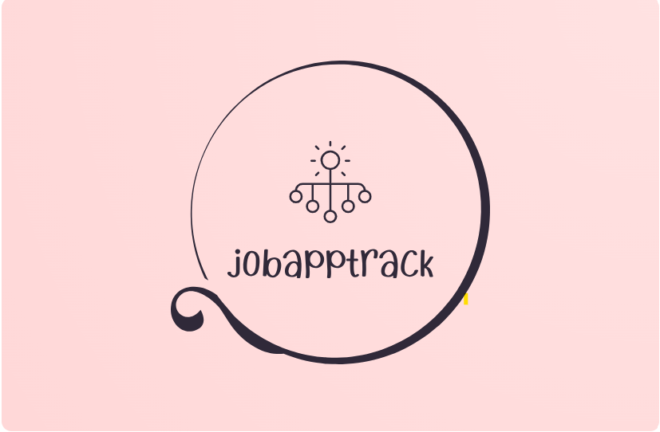

# ChatGPT Plugin for Job Application Tracker

<div align="center">
  
</div>

## Overview

The ChatGPT Plugin for Job Application Tracker is a TypeScript and Next.js based solution designed to simplify the process of tracking job applications. The plugin leverages the capabilities of ChatGPT to generate summaries of job applications and integrates with CSV files to manage application data efficiently.

## Features

- **Job Application Summarization**: This plugin uses ChatGPT to create summarized versions of job applications, making it easier to quickly review application details.

- **CSV File Integration**: The plugin seamlessly interacts with CSV files that store job application data. This integration enables you to manage application information including statuses, dates, and more.

- **User-Friendly Interface**: Developed using Next.js, the plugin offers a user-friendly web interface that is both intuitive and responsive.

## Installation

1. Clone the repository:
   ```bash
   git clone https://github.com/your-username/chatgpt-job-tracker-plugin.git
   ```
2. Install dependencies:

   ```bash
       npm install
   ```

3. Environment Variables Setup:
   ```bash
    CSV_FILE_PATH=path/to/your/csv/file.csv
   ```
4. Start the development server:

   ```bash
       npm run dev
   ```

5. Develop you own plugin in ChatGPT plugin store:
   ```bash
       localhost:3000
   ```

## Usage

- **Upload CSV Data:** Upload your job application data in CSV format using the plugin interface.
- **Interaction:** Use the plugin to view application summaries, update statuses, and keep track of interview processes.
